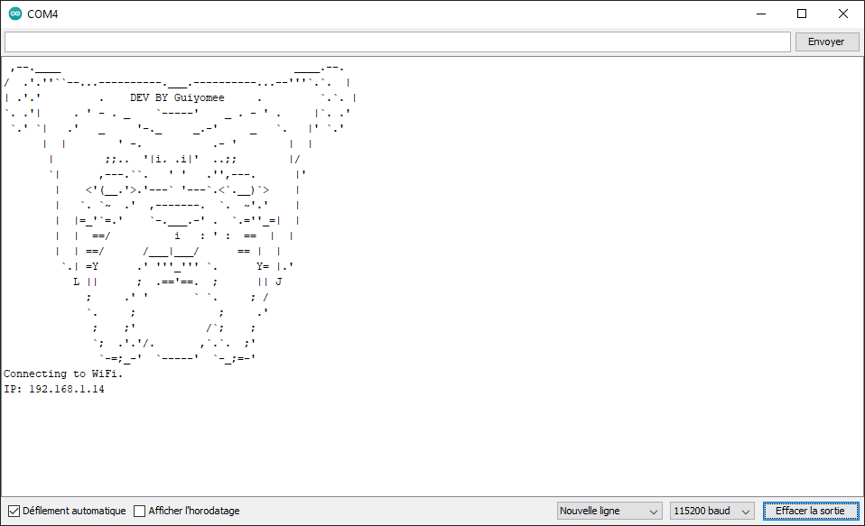

<div align="center">
    
  <h3>AutoPetFeeders</h3>
</div>

## Table of Contents

<details>
  <summary>Table of Contents</summary>
  <ol>
    <li>
      <a href="#about-the-project">The Project</a>
      <ul>
        <li><a href="#built-with">Built With</a></li>
        <li><a href="#description">Description</a></li>
        <li><a href="#screenshots">Screenshots</a></li>
      </ul>
    </li>
    <li>
      <a href="#getting-started">Getting Started</a>
      <ul>
        <li><a href="#prerequisites">Prerequisites</a></li>
        <li><a href="#installation">Installation</a></li>
      </ul>
    </li>
  </ol>
</details>


## Description

Feed your pet automatically with NodeMCU V3 (ESP8266)

## Screenshots
    soon Upload 3D File

## Built With 


## Prerequisites

    - NodeMCU V3 (ESP8266)
    - Stepper 5V + ULN2003
    - LED x2 (GREEN and RED)
    - BUTTON
    - RESISTOR (2 or 3)

## Installation

1. Connect your MCU card below
<div align="center">
  
</div>

2. Install Arduino IDE
    ```sh
    https://www.arduino.cc/en/software
    ```
   

3. Install Module NodeMCU on Arduino IDE
    ```sh
    https://randomnerdtutorials.com/how-to-install-esp8266-board-arduino-ide/
    ```

4. Install LittelFS 
    ```sh
    https://randomnerdtutorials.com/install-esp8266-nodemcu-littlefs-arduino/
    ```

5. Open browser AutoPetFeeders. ⚠️ Dont move data folder ⚠️
    ```sh
        ->AutoPetFeeder
          ->AutoPetFeeders.ino
          ->data
            ->config
              -lang.txt
            ->img
              -favicon.ico
            ->lang
              -fr.json
            ->style
              styles.css
            ajax.js
            feedersmanager.html
            index.html
            script.js
            wifi_setting.html
        ->image
          -> ....
    ```

6. Open AutoPetFeeders.ino with ArduinoIDE
<div align="center">
  
</div>

7. Upload LittleFS and Upload Arduino code
<div align="center">
  
  
</div>

8. If everything is good 😁
<div align="center">
  
</div>

9. You can connect with ip give in the console with your browser
<div align="center">
  
</div>

10. You will need to configure your distributor with the "Adjustment" button. All information must be printed in your Arduino console. You can also check them with:
    ```sh
    -> ip/morning.txt
    -> ip/evening.txt
    -> ip/portions.txt
    ```

